# Ant ADS-B Radar — Full Documentation

A full-screen, air-traffic-control–style kiosk console for the aircraft tracked by your
own ADS-B receiver. It is designed to read the output of
[Mictronics **readsb-protobuf**](https://github.com/Mictronics/readsb-protobuf) — so you
need an ADS-B receiver running that build, ideally on your local network (see
[What you need](../README.md#what-you-need) in the README). It polls readsb's protobuf
feed once a second, enriches every contact, and streams the result to a Svelte kiosk that
auto-rotates through **21 views**, organised into six themes.

All screenshots below were captured live at 1920×1080, one per view.

- [Architecture & data flow](#architecture--data-flow)
- [Data sources](#data-sources)
  - [1. readsb protobuf (the ADS-B host)](#1-readsb-protobuf-the-ads-b-host)
  - [2. readsb enrichment DB](#2-readsb-enrichment-db-registrationtypeoperator)
  - [3. External APIs](#3-external-apis)
  - [4. Local / static data](#4-local--static-data)
  - [5. Durable SQLite history](#5-durable-sqlite-history)
- [Backend HTTP API reference](#backend-http-api-reference)
- [The panels](#the-panels) — every view documented with a screenshot
- [Scope layers, controls & deep-links](#scope-layers-controls--deep-links)
- [The configuration page](#the-configuration-page) — station settings; reordering, hiding and dwell times
- [The ceiling projector](#the-ceiling-projector--above) — the `/above` route
- [Configuration](#configuration) — environment variables, ports, adapting to your region
- [Develop & deploy](#develop--deploy)

---

## Architecture & data flow

```
readsb (:8080)                  backend (FastAPI :8001)              frontend (:3000)
  data/aircraft.pb  ──poll 1×/s─▶  decode protobuf + enrich  ──SSE──▶  SvelteKit kiosk
  data/receiver.pb                 aggregate (nearest, stats)          21 rotating views
  data/stats.pb                    cache + publish  ◀──HTTP GET──       (SSR-hydrated)
  db/*.json (enrich)
                                   also proxies (cached):
                                     planespotters · adsbdb · aviationweather
                                   durable SQLite history + on-disk photo cache
```

| Layer      | Technology |
|------------|------------|
| Backend    | FastAPI + Pydantic v2 + httpx + protobuf, run with `uv` / uvicorn |
| Frontend   | SvelteKit + Svelte 5 (runes) + Tailwind v4 + shadcn-svelte (bits-ui), adapter-node SSR |
| Real-time  | Server-Sent Events (SSE) at ~1 Hz |
| Containers | Docker Compose (`backend` :8001, `frontend` :3000) |

**Pipeline.** The backend collector (`sse/collector.py`) polls the three readsb `.pb`
endpoints every `READSB_POLL_INTERVAL` (1 s), decodes them with the vendored
`readsb.proto` bindings, enriches each aircraft (registration/type/operator, bearing,
flight level, vertical trend, emergency/squawk classification, emitter category), computes
aggregates (nearest, counts, extremes, coverage), caches the result, publishes a `radar`
snapshot + a `stats` payload over SSE, and folds each poll into the durable history. The
scope **auto-centers** on the receiver's own lat/lon (from `receiver.pb`, or a manual
position saved at `/config` — see [Station](#station)) and **auto-fits** its outer range
ring to the 95th-percentile contact distance.

**First paint.** Each page load does an SSR `load` that fetches `/api/radar/snapshot` +
`/api/radar/stats` so the kiosk paints instantly; the `SSEManager` also replays the last
event to every new subscriber, so live updates take over immediately.

---

## Data sources

### 1. readsb protobuf (the ADS-B host)

This is the single upstream, and a hard requirement: the Mictronics readsb-protobuf build
serves **protobuf only** — the dump1090-style `aircraft.json` path 404s — and the backend
reads three binary endpoints off `READSB_URL` (default `http://readsb:8080`). Other
readsb / dump1090 / tar1090 builds, which serve `aircraft.json`, are not supported. Decoded in
[`backend/app/services/readsb.py`](../backend/app/services/readsb.py):

| Endpoint | Protobuf message | What it carries |
|----------|------------------|-----------------|
| `GET /data/aircraft.pb` | `AircraftsUpdate` | live aircraft (`addr`, lat/lon, `alt_baro`, `gs`, `track`, `squawk`, `flight`, `category`, `rssi`, `messages`, `seen`, …), the `now` epoch, and the cumulative `messages` counter |
| `GET /data/receiver.pb` | `Receiver` | readsb version + **receiver lat/lon** (centers the scope) + refresh interval |
| `GET /data/stats.pb` | `Statistics` | period stats (latest / 1 min / 5 min / 15 min / total): message counts, max distance, MLAT & position tracks, CPR global ok/bad, local signal / noise / peak, and `polar_range` (72 buckets = 5° coverage rose) |

The schema is vendored at [`backend/app/proto/readsb.proto`](../backend/app/proto/readsb.proto);
generated bindings `readsb_pb2.py` are committed. Regenerate with
`backend/scripts/gen_proto.sh` (grpcio-tools via `uvx`, no system `protoc`).

**Field decoding notes** (learned from live decoding):
- `addr & 0xFFFFFF` → 6-hex ICAO; a non-ICAO `addr_type` is prefixed `~`.
- `squawk` is packed so its **hex** form is the 4-digit Mode A code (`f"{squawk:04X}"` →
  `"7000"`); `7500`/`7600`/`7700` ⇒ emergency.
- `category` hex is the ADS-B emitter code (`0xA3` → `"A3"` → "Large").
- `distance` is precomputed metres-to-site; bearing is derived great-circle.
- `seen` is an absolute epoch-**millisecond** timestamp ⇒ age = `now − seen/1000`.
- Period `messages`/duration span days, so the **instantaneous** Mode S rate is derived in
  the collector from the inter-poll delta of the cumulative `messages` counter.
- `polar_range` keys are bucket indices (72 buckets × 5°); values are metres (÷1852 → nm).

### 2. readsb enrichment DB (registration/type/operator)

No external aircraft dataset is used — enrichment comes from **readsb's own Mictronics
database**, fetched once over HTTP at startup from `READSB_URL/db/` and held in memory
([`backend/app/services/aircraft_db.py`](../backend/app/services/aircraft_db.py)). Staying
in-sync with readsb by design:

| File | Shape |
|------|-------|
| `GET /db/aircrafts.json` | `{"<HEX>": [registration, typeDesignator, flags]}` |
| `GET /db/types.json` | `{"<TD>": [fullModel, engineCode, wakeCategory]}` |
| `GET /db/operators.json` | `{"<PFX>": [airline, country, telephony]}` — PFX = first 3 chars of callsign |

Set `ENRICH=false` to disable.

### 3. External APIs

All external calls go **through the backend** (server-side, cached) — the browser never
hits a third-party API directly. Every request uses a descriptive User-Agent of the form
`ant-adsb-radar/1.0 (+https://github.com/anthonyjhicks/ant-adsb-radar; ADS-B kiosk)` (planespotters
requires a non-browser UA). Nothing about your receiver — its position, its traffic — is
sent anywhere.

| Provider | Endpoint | Purpose | Cache |
|----------|----------|---------|-------|
| **planespotters.net** | `https://api.planespotters.net/pub/photos/hex/{hex}` | aircraft thumbnail photo + photographer credit + link | permanent on-disk (`/data/photos`, LRU-evicted at 1 GiB) |
| **adsbdb.com** | `https://api.adsbdb.com/v0/callsign/{callsign}` | flight route (origin → [midpoint] → destination, airline detail, flight number, telephony) | 6 h TTL |
| **adsbdb.com** | `https://api.adsbdb.com/v0/aircraft/{hex}` | airframe record (registered owner, manufacturer, owner country, operator flag) | 7 d TTL (in-memory) |
| **images.kiwi.com** | `https://images.kiwi.com/airlines/128/{iata}.png` | airline tail logo by IATA code | permanent on-disk (`/data/logos`, no eviction) |
| **flagcdn.com** | `https://flagcdn.com/w160/{iso2}.png` | country flag by ISO 3166-1 alpha-2 | permanent on-disk (`/data/flags`, no eviction) |
| **aviationweather.gov** | `https://aviationweather.gov/api/data/metar?ids={icao,…}&format=json` | METAR — the raw observation is decoded server-side (present weather, visibility in metres, cloud layers/ceiling, wind variability) alongside upstream's wind/temp/QNH/flight-category; several stations per call | 5 min TTL |

The photo proxy is two-stage: it fetches metadata from the planespotters API, then
downloads the thumbnail bytes, and caches **both** on disk — so a busy aircraft (an
approach regular) never re-hits planespotters or its CDN.

### 4. Local / static data

The "faint geographic map" on the scope is **not** an external tile server — it's local
GeoJSON shipped with the frontend:

- [`frontend/src/lib/data/coastline.json`, `land.json`, `rivers.json`](../frontend/src/lib/data) — map layers
- [`frontend/src/lib/data/airports.ts`](../frontend/src/lib/data/airports.ts) — airport markers
- [`frontend/src/lib/data/airspace.ts`](../frontend/src/lib/data/airspace.ts) — control-zone rings
- [`frontend/src/lib/data/runways.ts`](../frontend/src/lib/data/runways.ts) + the station
  catalogue in [`backend/app/routers/metar.py`](../backend/app/routers/metar.py) — runway
  layouts for the Weather & Runways cards

These describe the London terminal area and the British Isles; see
[Adapting it to your region](#adapting-it-to-your-region) to swap them for your own.

Aircraft you've **flown on** can be read from an optional external Postgres database via
`FLIGHTS_DB_URL` (read-only; refreshed hourly). It supplies both the set of registrations
and, per registration, the countries your flights on that airframe landed in — country
names are mapped to ISO 3166-1 alpha-2 codes
([`countries.py`](../backend/app/services/countries.py)) so the Flown card can show a row
of flags. Matching contacts are circled in magenta on the scopes. Leave `FLIGHTS_DB_URL`
empty to disable.

### 5. Durable SQLite history

readsb's own period stats are coarse and reset with the daemon, so the backend keeps its
own **SQLite** rollup ([`backend/app/services/history.py`](../backend/app/services/history.py))
on a Docker volume that survives redeploys. The collector calls `record()` once per
successful poll (off the event loop) and `record_gap()` when a poll fails. Four tables:

| Table | Grain | Feeds |
|-------|-------|-------|
| `hourly` | per-hour message volume, unique aircraft, peak contacts, max range, poll/fail counts | Activity Trends, Coverage uptime |
| `seen` | one row per (airframe, day) with enrichment | First Seen Today, new-airframes counter, Fleet 7d/30d, Type-Dex |
| `coverage` | best range per bearing per day | Coverage & Health, range records |
| `counters` | durable name→value (e.g. photo-cache hits/misses) | Activity Trends photo hit rate |

Empty rollups return empty collections, so a freshly-deployed kiosk renders a graceful
"collecting data" state until history accrues.

---

## Backend HTTP API reference

Base URL: `http://<host>:8001`. Routers live in
[`backend/app/routers/`](../backend/app/routers).

| Method & path | Returns |
|---------------|---------|
| `GET /api/health` | `{status, version(git sha), readsb_reachable, have_data}` — Compose healthcheck + deploy verification |
| `GET /api/radar/snapshot` | full `RadarSnapshot`: `aircraft[]`, `receiver` (`lat`, `lon`, `source` = `readsb` or `manual`), `counts`, `nearest[]`, `emergencies[]`, `polar_range`, `max_range_nm`, `messages_total`, `messages_per_sec` |
| `GET /api/radar/stats` | `RadarStats`: the five readsb periods (`latest`, `last_1min`, `last_5min`, `last_15min`, `total`) |
| `GET /api/events` | **SSE stream** — emits `event: radar` and `event: stats` ~1×/s; keepalive comment every 30 s; last event replayed to new subscribers |
| `GET /api/photo/{hex}` | `{thumbnail, link, photographer}` (fetches + caches from planespotters on first miss) |
| `GET /api/photo/img/{hex}` | cached JPEG bytes (`Cache-Control: immutable, max-age=1y`) |
| `GET /api/photo/stats` | `{hits, misses, hit_rate, cached_aircraft, bytes_used, bytes_max}` |
| `GET /api/route/{callsign}` | `{origin, midpoint, destination, airline, airline_icao/iata/country/callsign, flight_iata/icao}` via adsbdb (6 h cache); nulls for unknown callsigns |
| `GET /api/aircraft/{hex}` | `{manufacturer, type, icao_type, owner, owner_country, owner_country_iso, flag_code, photo}` via adsbdb (7 d cache) |
| `GET /api/logo/{iata}` | airline tail-logo PNG (kiwi.com proxy, on-disk cache); 404 when unknown |
| `GET /api/flag/{iso2}` | country-flag PNG (flagcdn proxy, on-disk cache); 404 when unknown |
| `GET /api/metar/{icao}` | decoded METAR (`weather[]` present-weather groups with labels, `visibility_m`, `cloud_layers[]`, `ceiling_ft`, `sky`, wind incl. `var_from/var_to`, `obs_time`, station `lat/lon`) + computed **active runways** and `runway_winds[]` (head/crosswind per end) |
| `GET /api/metar?ids=EGLL,EGKK,…` | `{stations: [...]}` — the same document for several stations in one call (one upstream request for the uncached ones) |
| `GET /api/history/summary` | `{today, yesterday}` day stats |
| `GET /api/history/hourly?hours=48` | hourly rollups (messages, unique aircraft, peak contacts, max range, polls/failures); max 168 h |
| `GET /api/history/today?limit=80` | first-seen-today log (newest first; `mil`/`interesting`/`rare` flags) |
| `GET /api/history/airframes` | new airframes (first-ever sightings) today / this week / this month vs all-time |
| `GET /api/history/diurnal` | weekday × hour-of-day traffic-intensity grid |
| `GET /api/history/leaders` | most-seen operators & types over 7 d / 30 d (distinct airframes) |
| `GET /api/history/lifelist` | every type ever logged with rarity (distinct days seen), rarest first |
| `GET /api/history/records` | furthest contact today / all-time + per-octant bests |
| `GET /api/history/coverage` | per-bearing range today vs all-time + 24 h uptime |
| `GET /api/history/aircraft/{hex}` | this station's own sighting log for one airframe: `{days_seen, first_seen, last_seen, callsigns[], mil, interesting}` |
| `GET /api/config/panels` | saved kiosk display config: `{order[], hidden[], dwell{}, updated_at}`. Empty `order` = no preference, use the built-in default |
| `PUT /api/config/panels` | save it; body `{order: ["scope", "strips", …], hidden: ["stats"], dwell: {"scope": 45000}}`. `hidden` and `dwell` are optional. `422` if the id lists aren't unique slugs or a dwell is outside 3000–600000 ms, `503` if the config dir isn't writable |
| `GET /api/config/station` | the station settings with defaults filled in: `{name, lat, lon, show_coords, local_label, local_nm, home_nm, metar_stations[], updated_at, readsb: {lat, lon}}` — `readsb` is the position readsb itself reports, so the editor can show what "automatic" resolves to |
| `PUT /api/config/station` | save them; body is the same document without `updated_at`/`readsb`. `lat`/`lon` both null = use readsb's position. `422` with a plain-English `detail` when a value is out of bounds (name ≤ 40 chars, lat −90…90, lon −180…180, local range 5–240 nm, home range 2–100 nm, up to 4 four-character ICAO codes), `503` if the config dir isn't writable |

---

## The panels

The kiosk auto-rotates through the 20 numbered views below (dwell time in parentheses),
grouped into six themes. Emergency Watch is listed among them for reference but is a
takeover, not a rotation member — it has no number and no dwell. Controls: **← →** switch · **space**/**P** pause · **1–9** jump ·
**S**/**V** toggle sweep/vectors. Deep-link any single view for a fixed wall panel:
`…/?view=<id>&paused=1`.

The numbering below is the **default** order; [`/config`](#display-config) reorders the
rotation, hides views you don't want, changes how long each stays up, and saves all of it
on the receiver. The `id` column is the stable handle — it's what `?view=` takes and what
the saved config stores. The dwell times in parentheses are the defaults; an override at
`/config` replaces one.

A persistent **top bar** (the station name from `/config`, its coordinates if you've
switched them on there, live contact/positioned counts and a UTC "Zulu" clock) and
**bottom bar** (view dots + name + progress) frame every panel. The green dot at top-left
shows SSE connectivity.

| # | id | View | Dwell | Group |
|---|-----|------|-------|-------|
| 1 | `scope` | Radar Scope | 20 s | Scopes |
| 2 | `local` | Local · *your label* (40 nm by default) | 18 s | Scopes |
| 3 | `home` | Local · Home (10 nm by default) | 16 s | Scopes |
| 4 | `airspace3d` | 3D Airspace | 18 s | Scopes |
| 5 | `strips` | Flight Strips | 16 s | Live tactical |
| 6 | `spotlight` | Closest Aircraft | 14 s | Live tactical |
| 7 | `photos` | Spotter Photos | 24 s | Live tactical |
| 8 | `interesting` | Interesting Airframes | 14 s | Live tactical |
| 9 | `movers` | Movers & Extremes | 14 s | Live tactical |
| — | `watch` | Emergency Watch | auto | Live tactical (takeover — not in the rotation) |
| 10 | `altitude` | Altitude Profile | 16 s | Live instruments |
| 11 | `signal` | Signal vs Range | 14 s | Live instruments |
| 12 | `trackrose` | Heading Rose | 14 s | Live instruments |
| 13 | `fleet` | Fleet & Operators | 14 s | Live instruments |
| 14 | `newtoday` | First Seen Today | 14 s | Durable history |
| 15 | `trends` | Activity Trends | 14 s | Durable history |
| 16 | `lifelist` | Type-Dex | 16 s | Durable history |
| 17 | `daylight` | Daylight | 14 s | Environment |
| 18 | `metar` | Weather & Runways | 18 s | Environment |
| 19 | `coverage` | Coverage & Health | 14 s | Receiver stats |
| 20 | `stats` | Signal & Stats | 14 s | Receiver stats |

---

### Scopes — the plan-position centrepieces

#### 1 · Radar Scope — `scope`

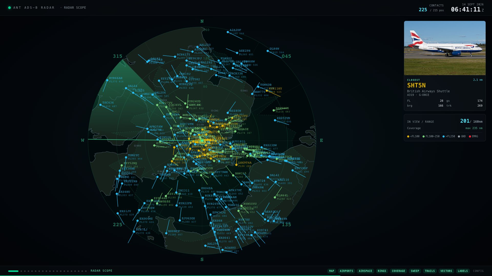

The centerpiece: a PPI (plan-position indicator) centered on the receiver. Range rings
auto-fit to traffic, with a bearing compass, a rotating sweep, the green coverage rose,
faint GeoJSON coastline, airspace rings, track trails, and aircraft blips with **velocity
leader lines** and data tags (`callsign` / `FL` / heading), colored by altitude band (amber
<FL100, green FL100–250, blue >FL250; red = emergency). The side card highlights the
**closest contact** with its photo and shows in-view/range + max coverage. Below it a
**flown** card rotates through the contacts you've flown on, ending in a row of flags for
the countries you've flown that airframe to. Footer chips toggle each layer.

#### 2 · Local · *your label* — `local`

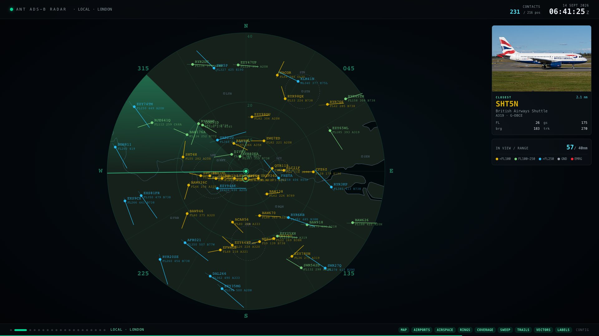

The same scope component locked to a fixed range — **40 nm** by default, enough to cover a
terminal area's airports — with **type designators** added to each tag (`FL60 229 A21N`)
and the coverage rose hidden for clarity. The range and the label in its name ("Local ·
London" here) are set on the [configuration page](#station); with no label it's called
"Local · 40 nm". Props: `{fixedNm, showType: true, hideCoverage: true}`.

#### 3 · Local · Home — `home`

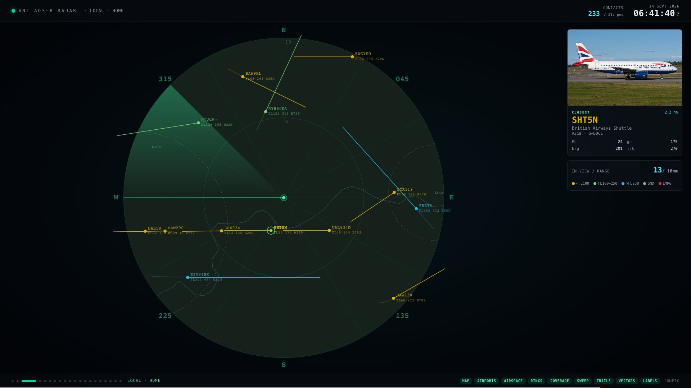

The tightest scope: a **10 nm** ring (also configurable) zoomed right in to the traffic
overhead the receiver, with type designators. A great-circle route line is drawn to the
closest contact. Props: `{fixedNm, showType: true, hideCoverage: true}`.

#### 4 · 3D Airspace — `airspace3d`

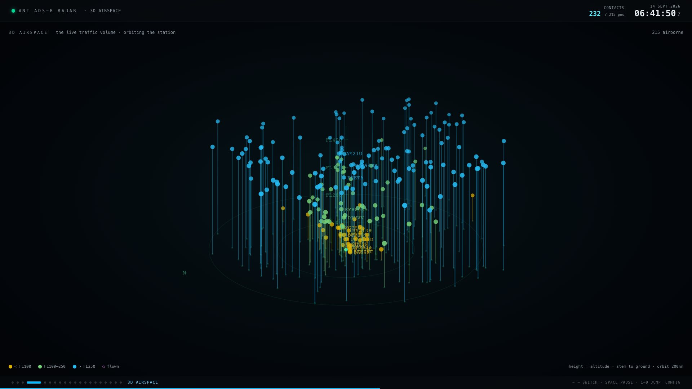

A WebGL volumetric view orbiting the station: each contact is a point at its bearing/range,
lifted to a height proportional to altitude, with a stem dropped to ground. Reference rings
mark FL200/FL300/FL400. Colored by altitude band; flown aircraft flagged.

---

### Live tactical — who's out there right now

#### 5 · Flight Strips — `strips`

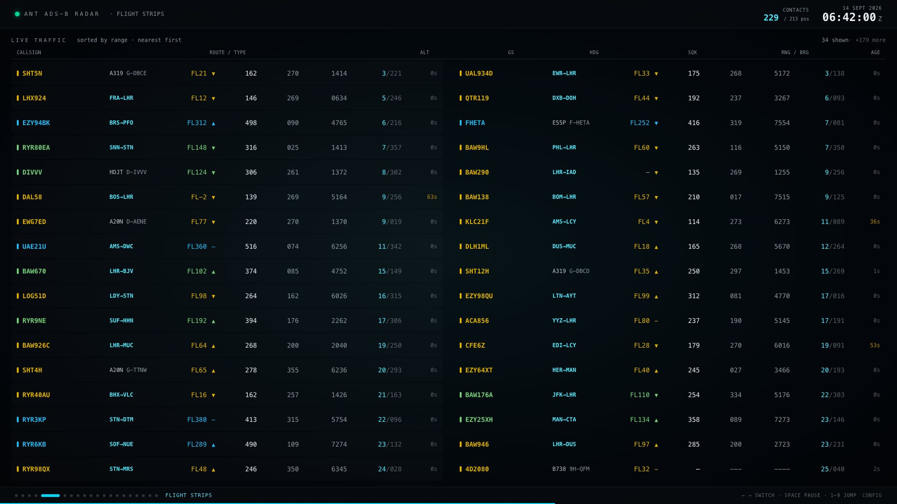

A controller-style strip board, **nearest-first**, two columns. Each strip: callsign, route
(origin→dest from adsbdb) / type, altitude with climb/descend arrow, ground speed, heading,
squawk (SQK), range/bearing (RNG/BRG), and age. Enriched with the aircraft DB and
per-callsign route lookups.

#### 6 · Closest Aircraft — `spotlight`

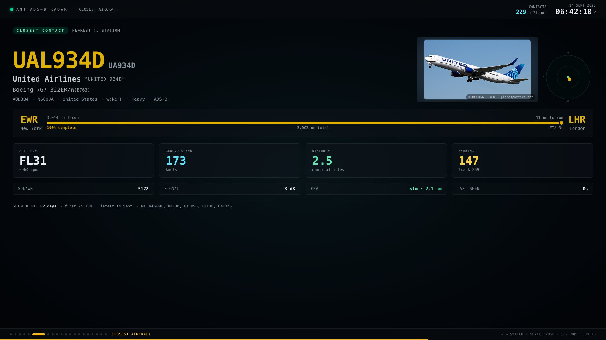

A deep-dive readout of the single nearest contact. Identity block: callsign (+ IATA
flight number), the registered owner with the **airline tail logo** and R/T telephony,
manufacturer + full model, and ICAO hex · registration · owner country · wake ·
category · position source. A large planespotters photo (a type silhouette when none
is cached) and a direction rose sit alongside. A **route strip** shows origin → [via]
→ destination with a live **progress bar** (percent flown, nm flown / to run, total,
ETA at current groundspeed). Metric tiles: altitude (+ vertical rate), ground speed,
distance, bearing/track; then squawk, signal, **closest-approach** estimate (time +
distance to the station), and last-seen age. A footer summarises how often *this*
station has logged the airframe (days seen, first/latest, callsigns used).

Sources: live snapshot + Mictronics enrichment, adsbdb route (`/api/route`) and
airframe (`/api/aircraft`), airline logo (`/api/logo`), and the local sighting log
(`/api/history/aircraft/{hex}`). Route progress and closest-approach are computed
client-side from the live position (`lib/utils/geo.ts`).

#### 7 · Spotter Photos — `photos`

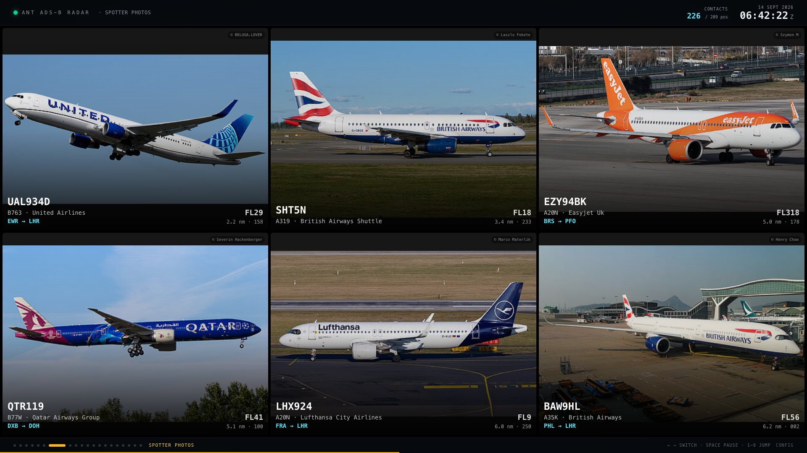

A 3×2 grid of the nearest **photographed** aircraft, served at native resolution from the
backend photo cache (planespotters imagery). Each cell overlays callsign, type · operator,
route, flight level, range/bearing, and the photographer credit. Longest dwell (24 s).

#### 8 · Interesting Airframes — `interesting`

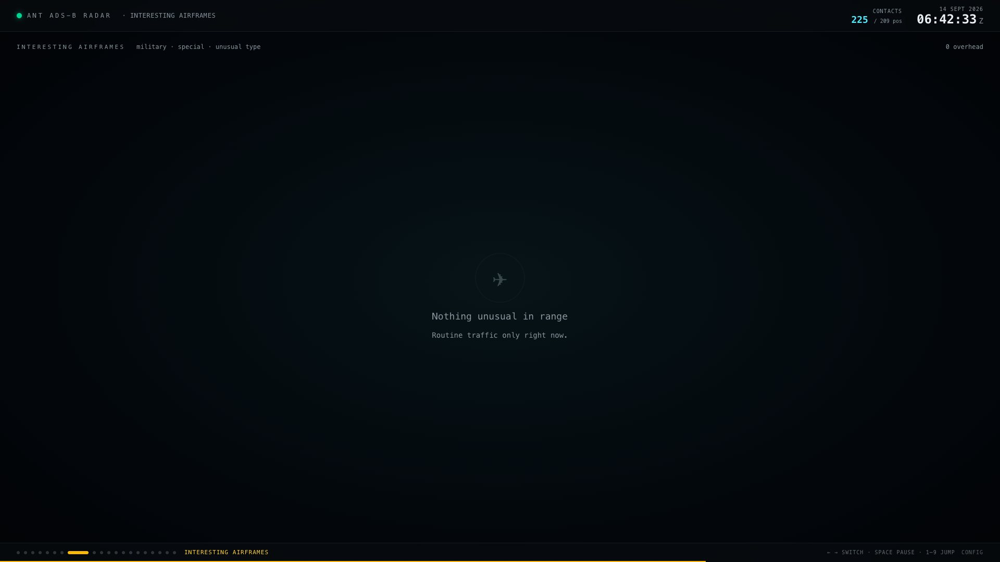

Out-of-the-ordinary contacts only, as photo cards — military, flagged "interesting"
(warbirds, heads of state, test aircraft), or an unusual emitter category (here a rotorcraft:
TDT04, A109). When nothing qualifies it shows a calm "Nothing unusual in range" state.

#### 9 · Movers & Extremes — `movers`

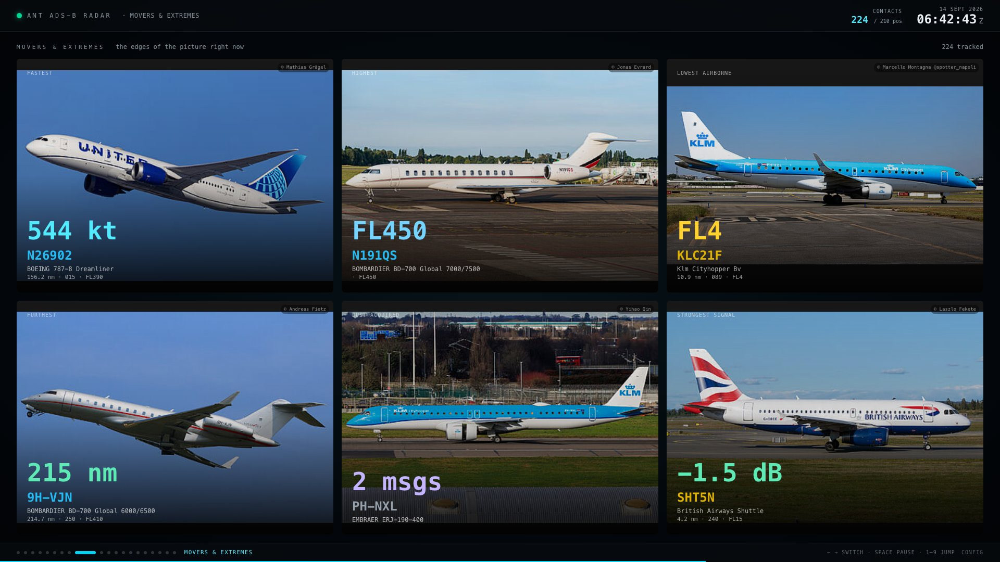

Six "edge of the picture" cards, each with the aircraft's photo: **fastest** (ground
speed), **highest** (FL), **lowest airborne**, **furthest** (nm), **just acquired** (fewest
messages), and **strongest signal** (RSSI dB).

#### Emergency Watch — `watch` (takeover)

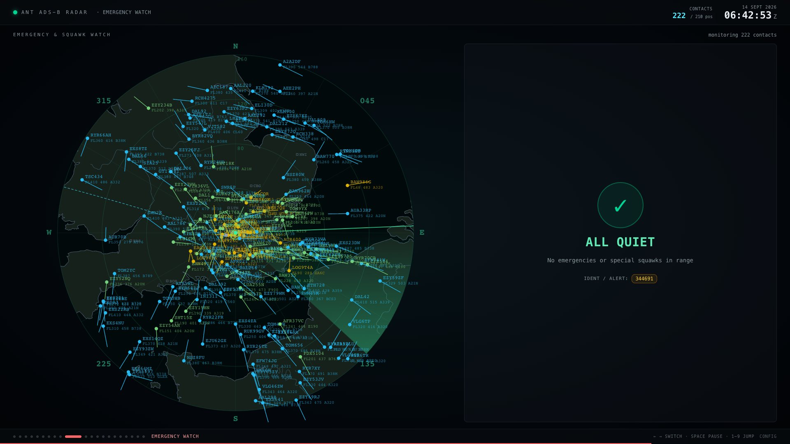

**This view is not in the rotation.** The kiosk never cycles past it. It takes the screen
the moment an aircraft squawks 7500 (hijack) / 7600 (radio failure) / 7700 (general
emergency), or sets the ADS-B emergency/priority flag, and **holds there until the
emergency clears** — an unattended wall display shouldn't rotate away from one. A screen
flash and audio klaxon fire at the same time.

While held, the footer shows a **HOLDING** chip and the dwell bar sits full; pressing
**← →** (or clicking a dot) releases the hold so a person at the keyboard isn't trapped,
and a *new* emergency re-takes the screen even if you'd navigated away.

The panel is a deep-dive on the aircraft, not a list. The left two-thirds is the **radar
scope** (the same PPI as the scope views, with its map, airports, airspace and every other
contact), auto-ranged in ring steps so the emergency contact sits inside about 70% of the
radius, with a red **target reticle** on it, a dashed **bearing line** from the station
labelled with range and bearing, its track trail and its great-circle route. The right
column is the aircraft: photo, callsign and R/T telephony, operator and registered owner,
model and registration, route, live telemetry (altitude, ground speed, track, range,
bearing, vertical rate), CPA to the station, signal and message counts, and how many days
this station has logged the airframe. Any further emergencies are listed underneath so a
second one isn't lost behind the first. A contact with no position (Mode S only) still
gets the detail column, with a note on the scope that it can't be placed.

The trigger is deliberately narrower than what the panel displays: the other special
squawks it recognises (7777 military/intercept, 7400 UAS lost link, 0000 non-discrete) are
shown when you visit the view but do **not** take over the screen — 0000 in particular is
common enough that holding the kiosk on it would be noise.

Outside an emergency the view is reachable only at `?view=watch`, which shows the scope
beside a calm green **"ALL QUIET"** card.

---

### Live instruments — analytics computed from the current snapshot

#### 10 · Altitude Profile — `altitude`

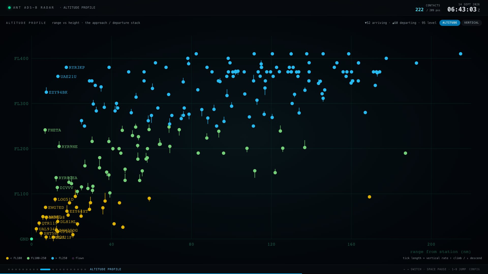

A range-vs-height scatter (x = range, y = FL) that visualises the approach/departure stack;
the tick length encodes vertical rate. The top-right **colour-lens toggle switches between
`ALTITUDE` band and `V` (vertical trend)** — recolouring the dots by climb / level / descent
so arrivals and departures separate out (the header counts "arriving / departing / level").
Flown aircraft are circled.

#### 11 · Signal vs Range — `signal`

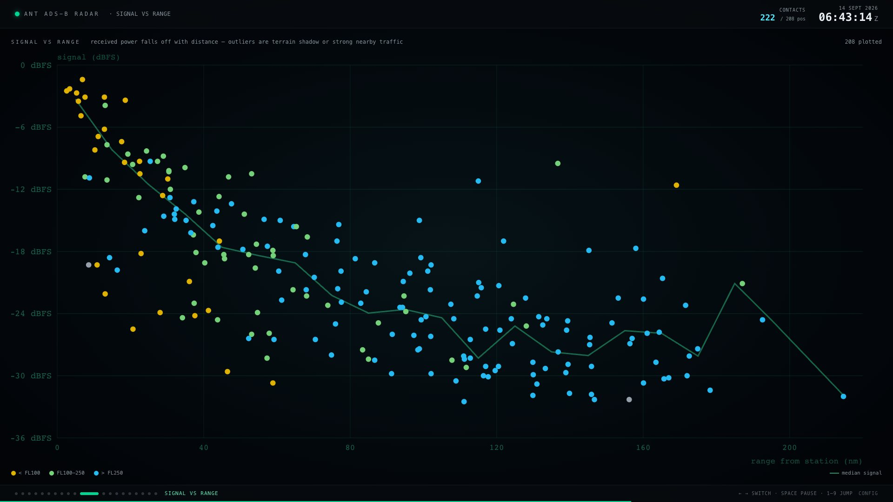

Received signal power (dBFS) plotted against range from the station, with a **median
signal** falloff curve — the receiver's link-budget envelope. Power falls off with distance
as expected; the informative part is the outliers — points well below the median are
terrain-shadowed, points well above are strong nearby traffic. Dots colored by altitude band.

#### 12 · Heading Rose — `trackrose`

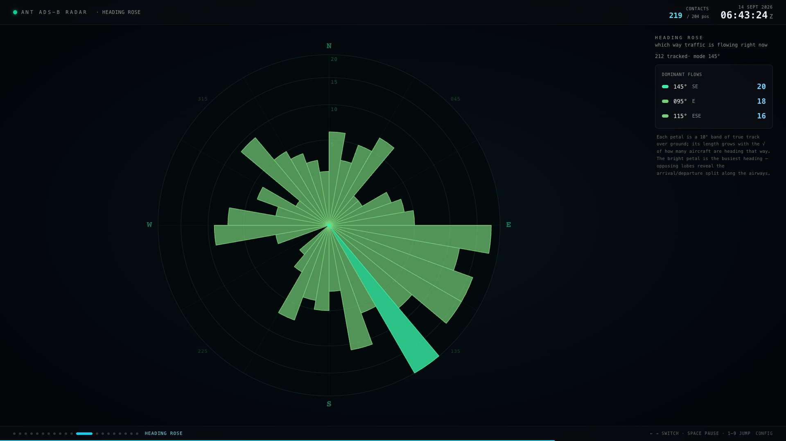

A wind-rose-style plot of **which way traffic is flowing right now**: each petal is a 10°
band of true track over ground, its length growing with the √ of how many aircraft head
that way. The brightest petal is the busiest heading; opposing lobes reveal the
arrival/departure split along the airways. Side panel lists the dominant flows.

#### 13 · Fleet & Operators — `fleet`

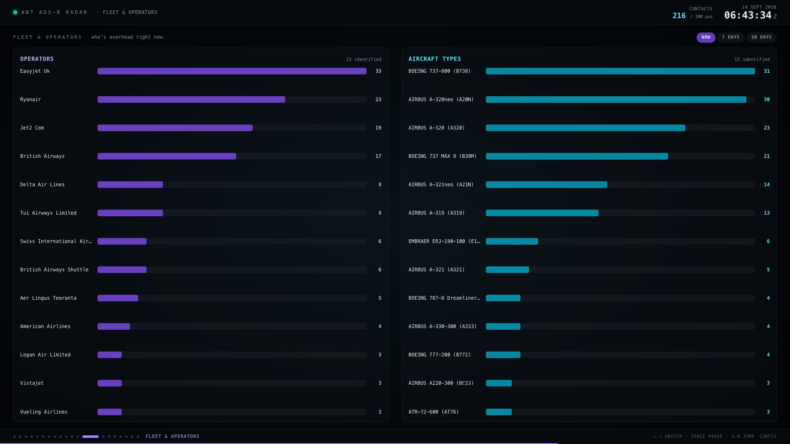

Bar charts of operators and aircraft types. The top-right **`Now / 7 days / 30 days`
toggle** switches between who's overhead right now (live from the snapshot) and the
most-seen operators/types over the last week or month (distinct airframes, from the SQLite
`seen` table).

---

### Durable history & trends — from the on-disk SQLite rollup

#### 14 · First Seen Today — `newtoday`

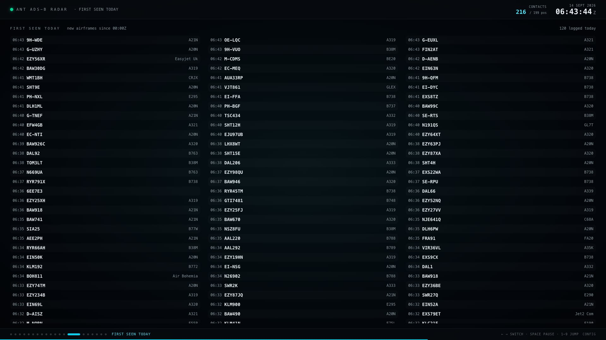

Every airframe logged for the first time since 00:00 Z, newest first, in a dense
time · callsign · type list. Rare types (not seen earlier today) and military/interesting
frames are highlighted.

#### 15 · Activity Trends — `trends`

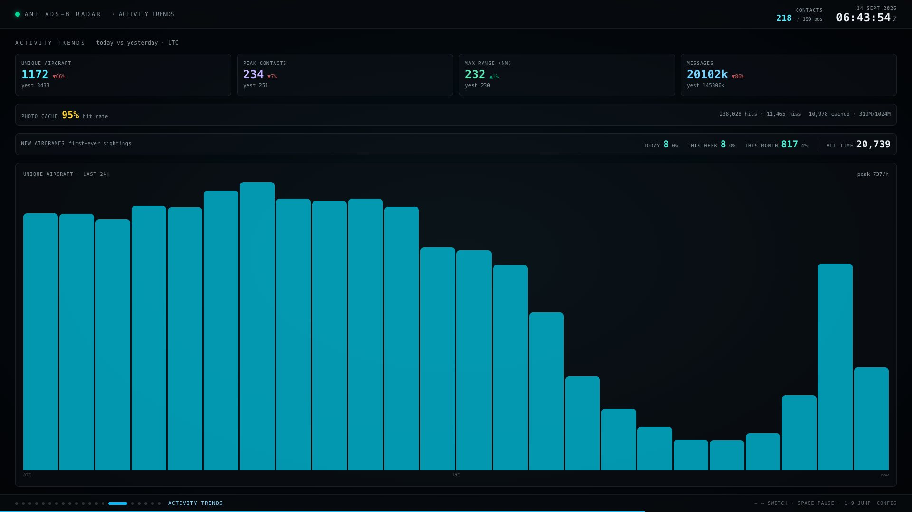

Durable trends: today-vs-yesterday cards (unique aircraft, peak contacts, max range,
messages, each with a % delta), the photo-cache hit rate, a **new-airframes** counter
(first-ever sightings today / this week / this month vs the all-time total), and a 24 h
hourly bar chart of unique aircraft.

#### 16 · Type-Dex — `lifelist`

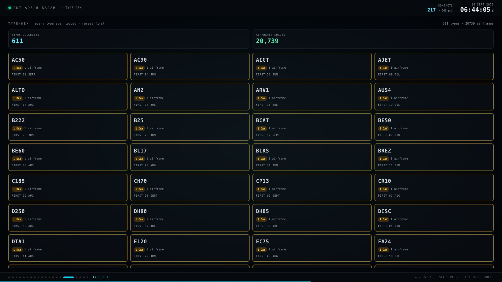

A "collection" of **every aircraft type ever logged**, rarest first — a card per type
designator showing how many days it's been seen, airframe count, and first-seen date;
military types flagged. Header totals (types collected and airframes logged) make it a
spotter's life-list.

---

### Environment

#### 17 · Daylight — `daylight`

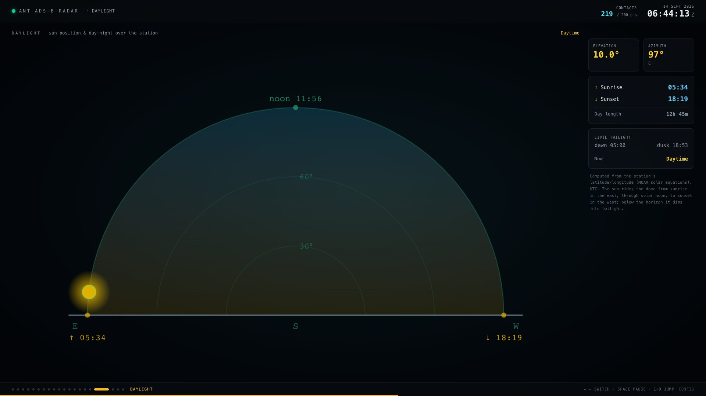

Sun position and day/night over the station, computed from the receiver's lat/lon with the
NOAA solar equations (UTC) — no external data. The sun rides a dome from sunrise (E) through
solar noon to sunset (W); side cards give current elevation/azimuth, sunrise/sunset, day
length, civil twilight (dawn/dusk), and whether it's currently day or night.

#### 18 · Weather & Runways — `metar`

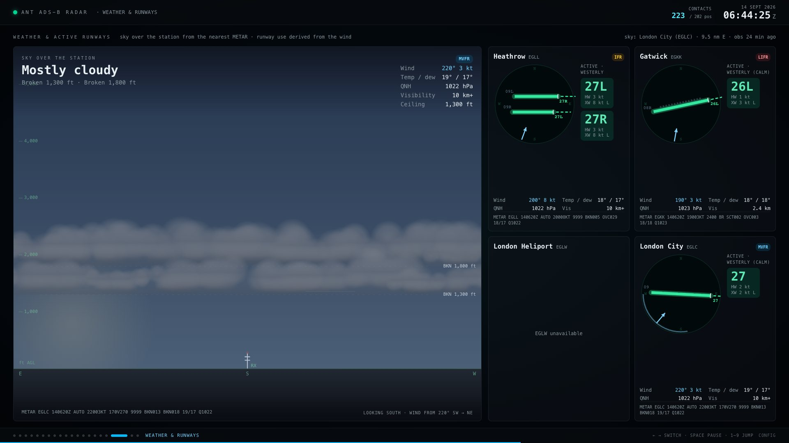

**The sky over the station**, animated on a canvas from the METAR nearest the receiver
that is currently reporting, among the airports chosen at `/config` (the header says
which station, how far away it is, and how old the observation is; a heliport that only
reports while open hands over to the next-nearest overnight). The view looks south, east on the left and west on the right,
like the Daylight dome, so the sun glow sits where the sun really is and the sky runs
day → twilight → night from the NOAA solar position (stars show through the gaps at
night). From the report:

- **Cloud decks** are drawn at their reported bases against a height ladder (ft AGL):
  a few puffs for FEW, more for SCT, a shaded band with puffs for BKN, and a full grey
  fill above the base for OVC; CB/TCU layers get towering, darker cloud. Each deck is
  labelled on the right (`BKN 1,200 ft`, `OVC 2,500 ft CB`).
- **Precipitation** falls from the CB (or the lowest solid deck): rain streaks, fine
  drizzle, swaying snowflakes, sleet (both), hail. Intensity follows `-`/none/`+`.
  Showers (`SH`) fall from a **cell that crosses with the wind**, with gaps between
  cells; `VC` weather parks a cell at the upwind edge. A thunderstorm (`TS`) adds
  sky flashes with a forked bolt every few seconds.
- **Fog / mist / haze** hug the ground (height and opacity from the code and the
  visibility; haze/smoke reads warmer) and wash out the scene.
- **Wind**: everything drifts at a speed proportional to the reported wind (higher
  decks a little faster), a westerly leftwards (eastward), an easterly rightwards;
  gusts arrive as periodic surges that slant the rain; streaks show the flow.
- The **receiver mast** at the centre with a blinking obstruction light marks "you
  are here". The HUD gives the headline (`Light rain showers`, `CAVOK`…), the layers,
  flight category, wind, temp/dew, QNH, visibility, ceiling, and the raw METAR.

**Runway cards** for the airports listed at `/config` — by default Heathrow (EGLL),
Gatwick (EGKK), the London Heliport (EGLW — a single FATO drawn with a helipad marker; it
only reports while open, so its card says "unavailable" overnight) and London City
(EGLC): a north-up schematic of the airport's runways with the **wind-favoured ends lit** and approach
chevrons streaming onto each threshold, the wind vector on the compass rim (plus the
`250V330` variability arc when reported), the ops direction (`Westerly`, `(calm)`
when the airport's calm-wind preference applies), **head/crosswind components** on
every active end (`HW 10 kt · XW 6 kt L`; `TW` for a tailwind), flight category,
wind/temp/QNH/visibility, and the raw METAR. Airports with no current METAR show
"unavailable"; an airport without a built-in runway layout shows its weather with a note
in place of the diagram (add one in `frontend/src/lib/data/runways.ts` and the backend
station catalogue). Reports refresh every 5 minutes; a failed refresh keeps the last good
ones and says so in the header.

---

### Receiver & data stats — last in the rotation

#### 19 · Coverage & Health — `coverage`

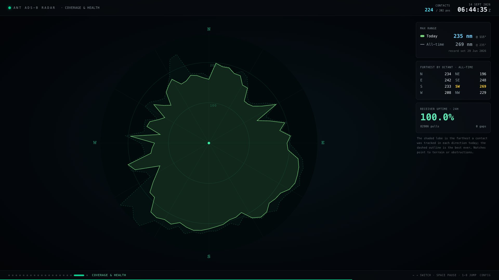

The receiver's reception polar plot: the shaded lobe is the farthest a contact was tracked
in each direction **today**, the dashed outline is the **best-ever** recorded (notches point
to terrain/obstructions). Side cards fold in the **range records** — today's & all-time max
range with bearing + date and a "NEW RECORD" flag, the per-octant bests (N/NE/E/…/NW) — plus
24 h receiver uptime (polls vs gaps).

#### 20 · Signal & Stats — `stats`

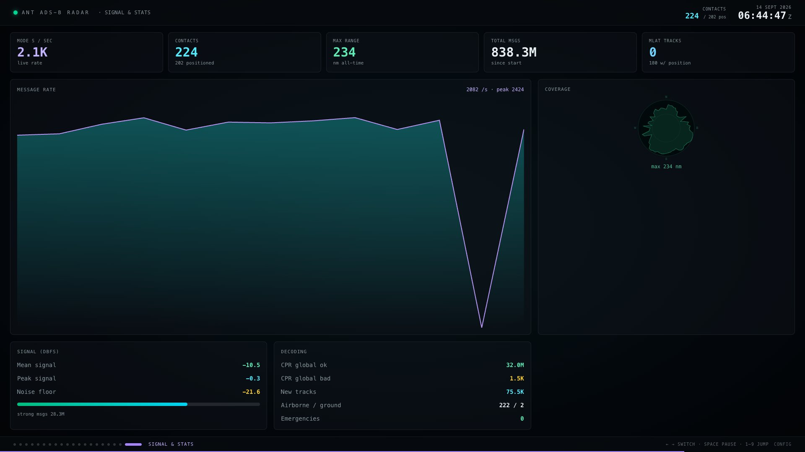

Receiver telemetry: live **Mode S messages/sec** (with a rolling sparkline + peak), contact
counts, all-time max range, total messages, MLAT tracks, a small coverage rose, the signal
block (mean/peak/noise dBFS + strong-message count), and decoding stats (CPR global ok/bad,
new tracks, airborne/ground split, emergencies).

---

## Scope layers, controls & deep-links

Every scope layer is toggleable from the footer chips on the scope views (`MAP · AIRPORTS ·
AIRSPACE · RINGS · COVERAGE · SWEEP · TRAILS · VECTORS · LABELS`). Choices persist in
`localStorage`.

**Keyboard** (whole kiosk): `←`/`→` prev/next view · `space` or `P` pause/resume ·
`1`–`9` jump to view · `S` toggle sweep · `V` toggle vectors.
**Touch** (mobile / <1024 px): swipe left/right to change view, tap to pause.

**URL parameters:**
- `?view=<id>` — start on a specific view (any id from the table above).
- `?paused=1` — hold there (ideal for a wall panel pinned to one view).
- `?sweep=0` / `?vectors=0` — deep-link a clean scope with those layers off.

Example fixed-panel links: `…/?view=local&paused=1`, `…/?view=scope&sweep=0&vectors=0`.

**Responsive stage.** The kiosk is a fixed 1920×1080 stage. On a wall display (≥1280×720)
it renders 1:1; on smaller screens (≥1024 px) the whole 16:9 stage scales to fit; below
1024 px it reflows to a mobile layout (best in landscape).

---

## The configuration page

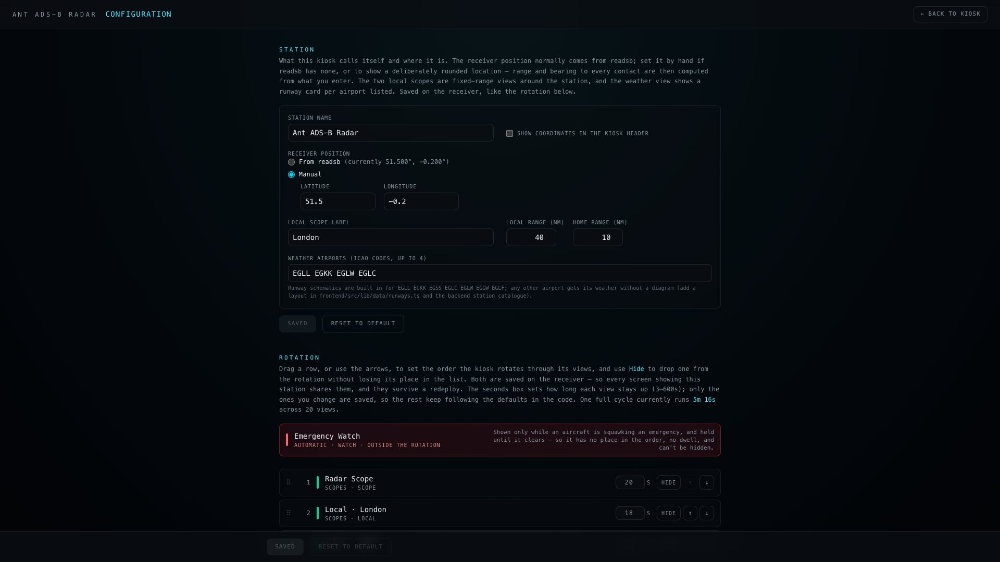

`/config` — linked from **CONFIG** at the bottom-right of every view — has two sections,
each with its own **Save**. Both are stored on the receiver (JSON files on the config
docker volume), not in the browser, so the wall display, a phone and a tablet all agree
and the settings survive a redeploy. The kiosk reads them in its SSR `load`, so a fresh
page already renders with them; a kiosk that's been up for days picks a change up next
time it loads.

### Station

- **Station name** — shown top-left of every view and as the page title.
- **Show coordinates in the kiosk header** — off by default. A wall display is often in
  view of visitors, and a photo of it shouldn't give the site away.
- **Receiver position** — *From readsb* uses the position readsb reports (shown beside the
  option so you can see what "automatic" resolves to). *Manual* takes a latitude and
  longitude instead: for a readsb that isn't configured with a location, or to show a
  deliberately rounded one. While a manual position is set the backend computes every
  contact's range and bearing from it — rather than trusting readsb's site-relative
  distance — so the range rings, the nearest-first ordering and the coverage history all
  agree with the centre of the scope. The snapshot reports which is in use as
  `receiver.source`.
- **Local scope label / range** and **Home range** — the two fixed-range scopes. The wide
  one is named "Local · *label*" (or "Local · *n* nm" with no label); 5–240 nm. The tight
  one is "Local · Home"; 2–100 nm.
- **Weather airports** — up to four ICAO codes, in card order, for the Weather & Runways
  view. The sky follows whichever is nearest the receiver and reporting.

Everything is validated on both sides: the Save button explains what's wrong before it
sends, and the backend's own message is shown if it disagrees. The file
(`STATION_CONFIG_PATH`, `/data/config/station.json`) holds only the settings you've
changed, so a default changed in a later version still reaches an installation that
never overrode it:

```json
{
  "name": "Ant ADS-B Radar",
  "local_label": "London",
  "metar_stations": ["EGLL", "EGKK", "EGLW", "EGLC"],
  "updated_at": 1789314836.46
}
```

Hand edits are fine and take effect on the next poll; a key that doesn't validate is
ignored on its own rather than resetting the whole station.

### Rotation

Sets which views the kiosk rotates through and in what order. Drag a row, or nudge it with the `↑`/`↓`
buttons (which also make it work from a keyboard or a touchscreen), use **Hide** to drop a
view from the rotation, and set the **seconds** box to change how long a view stays up
(3–600 s; out-of-range entries are clamped). Then **Save order**. **Reset to default**
restores the built-in order, un-hides everything and returns every dwell to its default in
the editor; it still needs a save to take effect. The page shows each view's group and
`id`, plus the length of one full cycle over the views still in rotation.

Only the dwells you actually change are saved, and setting one back to its default drops
it again. An untouched view keeps following the number in the code, so changing a default
in `panels.ts` still reaches every installation that never overrode it.

A hidden view keeps its place in the list — greyed out, one click from coming back — so
hiding is never a one-way door. At least one view must stay visible; the last **Hide**
button disables itself rather than leaving the kiosk with nothing to show.

Two things hiding deliberately does *not* do:

- **`?view=<id>` still works on a hidden view.** A deep-link is an explicit request, and
  pinning a wall display to a view you've kept out of the main rotation is a reason to
  hide it, not a contradiction. The un-hiding applies to that tab only.
- **Emergency Watch isn't in the list at all.** It's a takeover rather than a rotation
  member (see [its section](#emergency-watch--watch-takeover)), so it has no position, no dwell
  and no hide toggle — `/config` shows it as a fixed card explaining that. Emergencies
  always reach the screen; there's nothing to misconfigure.

Where the scope-layer toggles are per-browser (`localStorage`), the view order is `PUT`
to the backend and written to `PANEL_CONFIG_PATH` (`/data/config/panels.json`). The file
is just a list of ids:

```json
{
  "order": ["watch", "scope", "local", "home", "strips"],
  "hidden": ["stats"],
  "dwell": { "scope": 45000 },
  "updated_at": 1788937670.735832
}
```

Because it's only ids, it can't rot: on load the kiosk reconciles the saved config against
its registry (`frontend/src/lib/panels.ts`) — ids for views that no longer exist are
dropped, and views added since the config was saved are spliced in at their default
position, so a new view lands with its group rather than at the end. Hiding is stored as
an opt-out list for the same reason: a view added in code later is visible by default,
where a list of *visible* ids would have silently swallowed it.

A missing, empty or unreadable file, or an unreachable backend, all mean the same thing:
default order, nothing hidden, default dwells. A malformed `hidden` or `dwell` is dropped
on its own rather than discarding a good `order`. Editing the file by hand is fine; it's
re-read on every request — but a file that hides every view is ignored (the kiosk shows
everything) rather than leaving it with nothing to render, and a dwell outside
3000–600000 ms falls back to the view's default rather than spinning the rotation as fast
as the tick fires.

---

## The ceiling projector — `/above`

A separate route, not part of the kiosk: point a projector at the ceiling and `/above`
draws ATC-style tracks — the same blip, velocity leader and data tag as the scope — for
every low, non-climbing arrival within a few miles, gliding across an otherwise black
screen in its true direction of flight, so the projected track lines up with the real
aircraft passing overhead. Keys rotate, mirror and flip the image to match the projector's
placement, and the calibration is remembered per browser. The controls are listed at the
top of [`frontend/src/routes/above/+page.svelte`](../frontend/src/routes/above/+page.svelte).

---

## Configuration

All runtime config is environment-driven. The root `.env` feeds the backend container and
the frontend build; backend-only defaults live in
[`backend/app/config.py`](../backend/app/config.py).

### Environment variables

| Var | Default | Purpose |
|-----|---------|---------|
| `READSB_URL` | `http://readsb:8080` | Upstream readsb protobuf host. Point it at your readsb host's LAN address, **or** join readsb's Docker network and use the service name. |
| `READSB_POLL_INTERVAL` | `1.0` | Seconds between readsb polls. |
| `NEAREST_COUNT` | `12` | How many nearest aircraft to surface in the `nearest` aggregate. |
| `PUBLIC_API_URL` | `http://localhost:8001` | Browser-reachable backend (API + SSE). **Baked in at frontend build time** (Compose build arg) — must be reachable from the kiosk/client network. |
| `ORIGIN` | `http://localhost:3000` | adapter-node origin (CSRF / absolute URLs) for the frontend. |
| `FRONTEND_PORT` / `BACKEND_PORT` | `3000` / `8001` | Host ports published by Compose (the containers always listen on 3000 / 8001). Set both, and `PUBLIC_API_URL` / `ORIGIN` to match, to run a second instance beside another. |
| `INTERNAL_API_URL` | `http://backend:8001` | SSR-side base URL; set to the Compose service name in `docker-compose.yml`. |
| `FLIGHTS_DB_URL` | *(empty)* | Read-only Postgres connection string of an optional personal flights database, for the flown-on flagging (the tables it expects are described in [`flown.py`](../backend/app/services/flown.py)). Empty disables the feature. |
| `ENRICH` | `true` | Fetch the aircraft/type/operator DB from `READSB_URL/db/` at startup. |
| `FLOWN_REFRESH_INTERVAL` | `3600.0` | Seconds between flown-registration refreshes. |
| `PHOTO_CACHE_DIR` | `/data/photos` | On-disk thumbnail cache (Docker volume). |
| `PHOTO_CACHE_MAX_BYTES` | `1073741824` (1 GiB) | Cache ceiling; LRU-evicts to ~90 % when exceeded. `0` = unbounded. |
| `HISTORY_DB_PATH` | `/data/history/history.db` | SQLite history DB (Docker volume). Empty disables history. |
| `PANEL_CONFIG_PATH` | `/data/config/panels.json` | JSON file holding the kiosk view order, hidden views and dwell overrides set at `/config` (Docker volume). Empty disables saving — the kiosk then always uses its defaults. |
| `STATION_CONFIG_PATH` | `/data/config/station.json` | JSON file holding the station settings set at `/config` (same volume). Empty disables saving — the kiosk then uses the built-in defaults and readsb's own position. |
| `CORS_ORIGINS` | `["*"]` | Origins allowed to hit the API / SSE. |
| `GIT_COMMIT` | `unknown` | Stamped into `/api/health` at deploy for version verification. |

### Ports

| Service | Port |
|---------|------|
| frontend (adapter-node) | **3000** |
| backend (uvicorn) | **8001** |
| readsb (upstream, external) | **8080** |

### docker-compose

[`docker-compose.yml`](../docker-compose.yml) defines two services:

- **`backend`** — builds `./backend`, publishes `:8001`, reads `.env`, healthchecks
  `/api/health`, and mounts named volumes that survive rebuilds: `photo-cache →
  /data/photos`, `logo-cache → /data/logos`, `flag-cache → /data/flags`,
  `history → /data/history` and `config → /data/config`.
- **`frontend`** — builds `./frontend` with `PUBLIC_API_URL` as a **build arg**, publishes
  `:3000`, sets `ORIGIN` + `INTERNAL_API_URL=http://backend:8001`, and waits for the
  backend to be healthy.

### Pointing the backend at readsb

Two options:
1. **Host LAN address:** set `READSB_URL=http://<readsb-host>:8080` — works when readsb
   publishes `:8080` on its host.
2. **Shared Docker network:** join readsb's Compose network and use
   `READSB_URL=http://readsb:8080`.

### Adapting it to your region

The station settings at `/config` cover the name, position, scope ranges and weather
airports. The rest of the geography is data files, all under
[`frontend/src/lib/data/`](../frontend/src/lib/data) unless noted:

| File | What it is | Shape |
|------|------------|-------|
| `airports.ts` | airport markers on the scopes (clipped to the visible range, so regional fields only show when zoomed out) | `{code, name, lat, lon}` |
| `airspace.ts` | control-zone rings | `{label, lat, lon, radiusNm}` |
| `runways.ts` | runway layouts for the Weather & Runways cards: each strip's centre offset from the reference point (metres east/north), true heading of the first-named end, length; optional `standby` and `heliport` | keyed by ICAO |
| `backend/app/routers/metar.py` `STATIONS` | the same airports for the backend's wind maths: reference lat/lon, elevation, runway ends with headings, calm-wind preference | keyed by ICAO |
| `coastline.json`, `land.json`, `rivers.json` | the faint map underlay | `{lines: [[lon, lat], …][]}` / `{polys: …}` |

The shipped map covers roughly 47.5–55.8°N, 9°W–6.7°E (the British Isles and the near
continent). For another area, extract polylines from a source such as Natural Earth
(10 m coastline, land and rivers), clip to a few hundred nautical miles around your
station, and write them in the same shape; the scope projects them with a flat
equirectangular approximation centred on the receiver.

---

## Develop & deploy

### Local development

```bash
# Backend — point READSB_URL at your readsb host
cd backend && uv sync
READSB_URL=http://<readsb-host>:8080 uv run uvicorn app.main:app --reload --port 8001

# Frontend
cd frontend && npm install && npm run dev        # http://localhost:5173
```

`frontend/.env` sets `PUBLIC_API_URL` for the browser → backend (defaults to
`http://localhost:8001`). Regenerate protobuf bindings after editing
`backend/app/proto/readsb.proto` with `backend/scripts/gen_proto.sh`.

### Deploy

On the host itself, `docker compose up -d --build` with a `.env` made from
[`.env.example`](../.env.example) (`READSB_URL`, `PUBLIC_API_URL`, `ORIGIN`) is all it
takes. To push from a workstation, [`deploy.sh`](../deploy.sh) does rsync + Docker
Compose over SSH:

```bash
DEPLOY_HOST=user@radar-host ./deploy.sh --deploy   # rsync code + compose build/up (stamps GIT_COMMIT)
./deploy.sh --status      # docker compose ps
./deploy.sh --logs-be     # tail backend logs   (--logs-fe / --logs for the others)
./deploy.sh --verify      # confirm deployed git sha == local HEAD (via /api/health)
```

`DEPLOY_HOST` (and `REMOTE_DIR`, default `/opt/ant-adsb-radar`) can also live in a gitignored
`.deploy.env`. The `.env` on the host is never written by a deploy.

Two GitHub Actions workflows ship with the repo: [`ci.yml`](../.github/workflows/ci.yml)
lints, type-checks, tests and builds on every push and pull request, and the optional
[`deploy.yml`](../.github/workflows/deploy.yml) deploys from a self-hosted runner when the
`DEPLOY_HOST` repository variable is set (with `REMOTE_DIR` and, optionally, a
`DOTENV_COMMAND` that renders the runtime `.env` from your secrets manager).

Then point the kiosk display at `http://<host>:3000`. Ports: frontend **3000**, backend
**8001** (readsb stays on **8080**).

---

*Screenshots in [`docs/screenshots/`](screenshots/) were captured live at 1920×1080, one
per view.*
